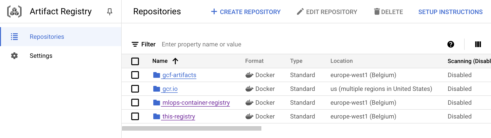

# Exam template for 02476 Machine Learning Operations

This is the report template for the exam. Please only remove the text formatted as with three dashes in front and behind
like:

```--- question 1 fill here ---```

Where you instead should add your answers. Any other changes may have unwanted consequences when your report is
auto-generated at the end of the course. For questions where you are asked to include images, start by adding the image
to the `figures` subfolder (please only use `.png`, `.jpg` or `.jpeg`) and then add the following code in your answer:

```markdown

```

In addition to this markdown file, we also provide the `report.py` script that provides two utility functions:

Running:

```bash
python report.py html
```

Will generate a `.html` page of your report. After the deadline for answering this template, we will auto-scrape
everything in this `reports` folder and then use this utility to generate a `.html` page that will be your serve
as your final hand-in.

Running

```bash
python report.py check
```

Will check your answers in this template against the constraints listed for each question e.g. is your answer too
short, too long, or have you included an image when asked. For both functions to work you mustn't rename anything.
The script has two dependencies that can be installed with

```bash
pip install typer markdown
```

## Overall project checklist

The checklist is *exhaustive* which means that it includes everything that you could do on the project included in the
curriculum in this course. Therefore, we do not expect at all that you have checked all boxes at the end of the project.
The parenthesis at the end indicates what module the bullet point is related to. Please be honest in your answers, we
will check the repositories and the code to verify your answers.

### Week 1

* [x] Create a git repository (M5)
* [x] Make sure that all team members have write access to the GitHub repository (M5)
* [x] Create a dedicated environment for you project to keep track of your packages (M2)
* [x] Create the initial file structure using cookiecutter with an appropriate template (M6)
* [x] Fill out the `data.py` file such that it downloads whatever data you need and preprocesses it (if necessary) (M6)
* [x] Add a model to `model.py` and a training procedure to `train.py` and get that running (M6)
* [x] Remember to fill out the `requirements.txt` and `requirements_dev.txt` file with whatever dependencies that you
    are using (M2+M6)
* [x] Remember to comply with good coding practices (`pep8`) while doing the project (M7)
* [x] Do a bit of code typing and remember to document essential parts of your code (M7)
* [x] Setup version control for your data or part of your data (M8)
* [ ] Add command line interfaces and project commands to your code where it makes sense (M9)
* [x] Construct one or multiple docker files for your code (M10)
* [x] Build the docker files locally and make sure they work as intended (M10)
* [x] Write one or multiple configurations files for your experiments (M11)
* [x] Used Hydra to load the configurations and manage your hyperparameters (M11)
* [x] Use profiling to optimize your code (M12)
* [x] Use logging to log important events in your code (M14)
* [x] Use Weights & Biases to log training progress and other important metrics/artifacts in your code (M14)
* [ ] Consider running a hyperparameter optimization sweep (M14)
* [x] Use PyTorch-lightning (if applicable) to reduce the amount of boilerplate in your code (M15)

### Week 2

* [x] Write unit tests related to the data part of your code (M16)
* [x] Write unit tests related to model construction and or model training (M16)
* [x] Calculate the code coverage (M16)
* [x] Get some continuous integration running on the GitHub repository (M17)
* [x] Add caching and multi-os/python/pytorch testing to your continuous integration (M17)
* [x] Add a linting step to your continuous integration (M17)
* [x] Add pre-commit hooks to your version control setup (M18)
* [ ] Add a continues workflow that triggers when data changes (M19)
* [ ] Add a continues workflow that triggers when changes to the model registry is made (M19)
* [x] Create a data storage in GCP Bucket for your data and link this with your data version control setup (M21)
* [x] Create a trigger workflow for automatically building your docker images (M21)
* [x] Get your model training in GCP using either the Engine or Vertex AI (M21)
* [x] Create a FastAPI application that can do inference using your model (M22)
* [x] Deploy your model in GCP using either Functions or Run as the backend (M23)
* [ ] Write API tests for your application and setup continues integration for these (M24)
* [ ] Load test your application (M24)
* [ ] Create a more specialized ML-deployment API using either ONNX or BentoML, or both (M25)
* [x] Create a frontend for your API (M26)

### Week 3

* [ ] Check how robust your model is towards data drifting (M27)
* [ ] Deploy to the cloud a drift detection API (M27)
* [ ] Instrument your API with a couple of system metrics (M28)
* [ ] Setup cloud monitoring of your instrumented application (M28)
* [ ] Create one or more alert systems in GCP to alert you if your app is not behaving correctly (M28)
* [ ] If applicable, optimize the performance of your data loading using distributed data loading (M29)
* [ ] If applicable, optimize the performance of your training pipeline by using distributed training (M30)
* [ ] Play around with quantization, compilation and pruning for you trained models to increase inference speed (M31)

### Extra

* [ ] Write some documentation for your application (M32)
* [ ] Publish the documentation to GitHub Pages (M32)
* [x] Revisit your initial project description. Did the project turn out as you wanted?
* [ ] Create an architectural diagram over your MLOps pipeline
* [x] Make sure all group members have an understanding about all parts of the project
* [x] Uploaded all your code to GitHub

## Group information

### Question 1
> **Enter the group number you signed up on <learn.inside.dtu.dk>**
>
> Answer:

MLOPS 46

### Question 2
> **Enter the study number for each member in the group**
>
> Answer:

 s204462, s234061, s233022, s204684

### Question 3
> **A requirement to the project is that you include a third-party package not covered in the course. What framework**
> **did you choose to work with and did it help you complete the project?**
>
> Recommended answer length: 100-200 words.
>
> Example:
> *We used the third-party framework ... in our project. We used functionality ... and functionality ... from the*
> *package to do ... and ... in our project*.
>
> Answer:

We chose the Hugging Face Transformers library as our third-party framework for this project. This library provides access to pre-trained transformer models like BERT and RoBERTa, which are highly effective for natural language processing (NLP) tasks. In our project, we used these models to fine-tune them on the title and selftext (body) of Reddit posts, enabling the classification of posts into five distinct mental health disorder categories. The framework simplified the implementation of complex NLP techniques by offering ready-to-use models and functionality, such as tokenization and training pipelines. This allowed us to focus on optimizing the classification task rather than building models from scratch, significantly enhancing our project’s efficiency and performance.

## Coding environment

> In the following section we are interested in learning more about you local development environment. This includes
> how you managed dependencies, the structure of your code and how you managed code quality.

### Question 4

> **Explain how you managed dependencies in your project? Explain the process a new team member would have to go**
> **through to get an exact copy of your environment.**
>
> Recommended answer length: 100-200 words
>
> Example:
> *We used ... for managing our dependencies. The list of dependencies was auto-generated using ... . To get a*
> *complete copy of our development environment, one would have to run the following commands*
>
> Answer:

We used pip to manage dependencies in our project, and both requirements.txt for production dependencies and requirements_dev.txt for development-specific tools. The requirements files contains a complete list of the packages and their specific versions needed to replicate our environment. This file was auto-generated using the command `pip freeze > requirements.txt` after ensuring all required dependencies were installed.

To get an exact copy of our environment, one would need to follow these steps:
1.	Clone the project repository: `git clone https://github.com/moorekevin/dtu-02476-mlops-project`
2.	CD to the project directory
3.	Create a virtual environment: python -m venv env.
4.	Activate the virtual environment: On Windows: `env\Scripts\activate` or On macOS/Linux: `source env/bin/activate`
5.	Install dependencies: `pip install -r requirements.txt`.
6.	Install development dependencies: `pip install -r requirements_dev.txt`

### Question 5

> **We expect that you initialized your project using the cookiecutter template. Explain the overall structure of your**
> **code. What did you fill out? Did you deviate from the template in some way?**
>
> Recommended answer length: 100-200 words
>
> Example:
> *From the cookiecutter template we have filled out the ... , ... and ... folder. We have removed the ... folder*
> *because we did not use any ... in our project. We have added an ... folder that contains ... for running our*
> *experiments.*
>
> Answer:

We utilized the cookiecutter template but we made some adjustments to better align the structure with our needs:
- src/: The core of the project is here, containing all modules for data processing, data loading, model definition, training, and evaluation.
- src/final_project/config/: We moved all configuration files (.yaml) into this directory from the original configs/ folder. This keeps configurations closer to the relevant source code for better organization.
- dockerfiles/: Maintained for Docker image creation, simplifying containerization for training and api deployment.
- tests/: Contains unit tests for key modules to ensure reliability and early bug detection.

Deviations:
1. Removed configs/: Centralized configurations in src/final_project/config/.
2.	Removed notebooks/: Since we didn’t use Jupyter notebooks, this folder was unnecessary and removed.
3.	Extended .gitignore: Added entries for runtime artifacts (e.g., lightning_logs/, .hydra/) and user-specific outputs to avoid cluttering the repository with changes caused by individual users running the code. which helped improve collaboration and version control
 
### Question 6

> **Did you implement any rules for code quality and format? What about typing and documentation? Additionally,**
> **explain with your own words why these concepts matters in larger projects.**
>
> Recommended answer length: 100-200 words.
>
> Example:
> *We used ... for linting and ... for formatting. We also used ... for typing and ... for documentation. These*
> *concepts are important in larger projects because ... . For example, typing ...*
>
> Answer:

We implemented rules for code quality and formatting using Ruff, a fast Python linter and formatter. These rules were enforced automatically via a GitHub Actions workflow (codecheck.yaml) that runs on every push or pull request to the main branch. The workflow ensures that all code adheres to predefined quality standards and is properly formatted before merging. Additionally, the workflow uses Python 3.11 and caches dependencies to optimize performance.

For typing, we used Python’s type hints and encouraged their use throughout the project to improve code clarity and reduce runtime errors. 

These concepts matter in larger projects because they prevent chaos as the codebase grows. For example, without proper formatting or typing, debugging a simple error like passing a string instead of an integer can waste hours. Good documentation means someone new to the project can quickly understand a function without needing to trace the entire code. Ultimately, these practices save time and make the codebase easier to work with for everyone involved.

## Version control

> In the following section we are interested in how version control was used in your project during development to
> corporate and increase the quality of your code.

### Question 7

> **How many tests did you implement and what are they testing in your code?**
>
> Recommended answer length: 50-100 words.
>
> Example:
> *In total we have implemented X tests. Primarily we are testing ... and ... as these the most critical parts of our*
> *application but also ... .*
>
> Answer:

In total, we implemented 23 tests in 5 files focusing on the core functionality (aka critical parts) of our project:
1. test_data_module: Ensures the data module initializes correctly and handles data loading and splitting.
2. test_data: Validates data preprocessing, including creating tensors and handling edge cases like missing or corrupted data.
3. test_evaluate: Checks that the evaluation process correctly computes metrics and handles predictions.
4. test_model: Ensures the model initializes, trains, and produces expected outputs without errors.
5. test_train: Verifies the training pipeline, including integration with data modules and saving the trained model.


### Question 8

> **What is the total code coverage (in percentage) of your code? If your code had a code coverage of 100% (or close**
> **to), would you still trust it to be error free? Explain you reasoning.**
>
> Recommended answer length: 100-200 words.
>
> Example:
> *The total code coverage of code is X%, which includes all our source code. We are far from 100% coverage of our **
> *code and even if we were then...*
>
> Answer:

The total code coverage of our project is 87%, which is a good indicator that most of our code is being tested. However, even if we achieved 100% coverage, it wouldn’t mean the code is completely error-free. Code coverage measures how much of the code runs during tests, but it doesn’t ensure all edge cases or real-world scenarios are considered.

For example, imagine a function that processes user input for a form. Our test might check that the function works fine when given valid input, like “John Doe,” but it might not test what happens if the input is an empty string, contains special characters, or is unexpectedly large. These edge cases could still cause the code to break, even if the function is 100% covered by tests.

### Question 9

> **Did you workflow include using branches and pull requests? If yes, explain how. If not, explain how branches and**
> **pull request can help improve version control.**
>
> Recommended answer length: 100-200 words.
>
> Example:
> *We made use of both branches and PRs in our project. In our group, each member had an branch that they worked on in*
> *addition to the main branch. To merge code we ...*
>
> Answer:

At the start of the project, we didn’t use branches or pull requests much because we wanted to work faster and avoid overhead. Now, we primarily use them for running status checks before merging changes into the main branch. This setup works, but it could be improved.

Using branches and pull requests consistently would make collaboration smoother. For example, each team member could have worked on their own branch for specific features or fixes. If someone was adding a new data processing step, they could do that in a separate branch without worrying about breaking the training pipeline in the main branch. Once finished, they could create a pull request, allowing the team to review the code, suggest improvements, and make sure everything works as expected before merging it.

This approach not only prevents accidental errors but also encourages better communication and keeps the main branch stable. It’s especially helpful in bigger teams or long-term projects where tracking changes and maintaining a clean codebase is critical.


### Question 10

> **Did you use DVC for managing data in your project? If yes, then how did it improve your project to have version**
> **control of your data. If no, explain a case where it would be beneficial to have version control of your data.**
>
> Recommended answer length: 100-200 words.
>
> Example:
> *We did make use of DVC in the following way: ... . In the end it helped us in ... for controlling ... part of our*
> *pipeline*
>
> Answer:

We made use of DVC in our project to manage data efficiently. We stored our dataset on a cloud storage bucket configured as a remote in DVC. Enabling version-aware functionality, we could keep track of changes to our dataset and link specific data versions to the corresponding code or model version.

Using DVC really helped us maintain a robust and reproducible machine learning pipeline by ensuring that every team member worked with the same dataset version, avoiding inconsistencies. Additionally, it streamlined collaboration by allowing us to manage large datasets without adding them directly to version control systems like Git (which wouldn't be possible due to the dataset size), reducing storage overhead and improving performance. However, we encountered some challenges with the pointers due to not setting it up correctly the first time. Our inexperience with DVC resulted in a lot of time spent debugging.

### Question 11

> **Discuss you continuous integration setup. What kind of continuous integration are you running (unittesting,**
> **linting, etc.)? Do you test multiple operating systems, Python  version etc. Do you make use of caching? Feel free**
> **to insert a link to one of your GitHub actions workflow.**
>
> Recommended answer length: 200-300 words.
>
> Example:
> *We have organized our continuous integration into 3 separate files: one for doing ..., one for running ... testing*
> *and one for running ... . In particular for our ..., we used ... .An example of a triggered workflow can be seen*
> *here: <weblink>*
>
> Answer:

We implemented GitHub workflows mainly for running unit tests whenever we push to a branch and for linting the code. These were organized in two separate files: `tests.yaml` and `codecheck.yaml`.

In `tests.yaml`, we install all dependencies on 3 different operating systems (Linux, Windows, macOS) with Python version 3.11. After that, we run all the unit tests using the command `coverage run -m pytest tests/`. This ensures all 23 unit tests pass and calculates the code coverage, which is then displayed in the logs for visibility. Running the tests on multiple operating systems guarantees compatibility across different environments, which is important for ensuring consistent behavior. This workflow can be seen here: [tests.yaml](https://github.com/moorekevin/dtu-02476-mlops-project/blob/main/.github/workflows/tests.yaml)

In `codecheck.yaml`, we use `ruff` to format our code every time we push, ensuring that new changes are consistently formatted across all files. This saves us from dealing with formatting issues in pull requests, reduces noise during reviews, and keeps the codebase clean.

We also considered adding workflows for building Docker images or running integration tests but decided to manage those tasks through external triggers instead, as it aligned better with our project setup and reduced the complexity of the workflows.

Overall, using these workflows has improved our development process by automating essential checks, saving time, and reducing manual errors. It has also increased confidence in our codebase's reliability and ensured better collaboration among team members.

## Running code and tracking experiments

> In the following section we are interested in learning more about the experimental setup for running your code and
> especially the reproducibility of your experiments.

### Question 12

> **How did you configure experiments? Did you make use of config files? Explain with coding examples of how you would**
> **run a experiment.**
>
> Recommended answer length: 50-100 words.
>
> Example:
> *We used a simple argparser, that worked in the following way: Python  my_script.py --lr 1e-3 --batch_size 25*
>
> Answer:

We configured our experiments using Hydra and tracked them with Weights & Biases (W&B). Hydra’s configuration files (fx train.yaml and data.yaml) store key parameters such as learning rate, batch size, and file paths, which makes it easy to manage and modify settings.

To run an experiment, you can run: `python src/final_project/train.py`

Hydra automatically loads the settings and w&b logs everything from metrics to hyperparameters and model checkpoints. This lets us track progress and compare results without manually keeping records.

### Question 13

> **Reproducibility of experiments are important. Related to the last question, how did you secure that no information**
> **is lost when running experiments and that your experiments are reproducible?**
>
> Recommended answer length: 100-200 words.
>
> Example:
> *We made use of config files. Whenever an experiment is run the following happens: ... . To reproduce an experiment*
> *one would have to do ...*
>
> Answer:

We again relied on a combination of Hydra and W&B. Hydra organizes all configurations in YAML files, ensuring every experiment’s settings are saved and easy to reuse. W&B logs all the important details—metrics, hyperparameters, and even the outputs like model files or loss curves—so we can always go back and review what worked (or often didn’t).

We also used a fixed random seed (seed: 42) throughout the project to ensure consistency across runs. If someone wants to reproduce an experiment, they can simply:
1. Grab the right configuration file (e.g., train.yaml).
2. Check W&B for the exact metrics and settings.
3. Run the experiment again


### Question 14

> **Upload 1 to 3 screenshots that show the experiments that you have done in W&B (or another experiment tracking**
> **service of your choice). This may include loss graphs, logged images, hyperparameter sweeps etc. You can take**
> **inspiration from [this figure](figures/wandb.png). Explain what metrics you are tracking and why they are**
> **important.**
>
> Recommended answer length: 200-300 words + 1 to 3 screenshots.
>
> Example:
> *As seen in the first image when have tracked ... and ... which both inform us about ... in our experiments.*
> *As seen in the second image we are also tracking ... and ...*
>
> Answer:


As seen in the figure, we ran three of our experiments using Weights & Biases to track training progress. These tests were run locally, so we limited the number of training epochs and reduced the percentage of our preprocessed dataset used for training. Our main focus was finding the optimal learning rate and the number of training steps.

Initially, we set the learning rate too high, which caused the model to overshoot and fail to converge. These runs, represented by the hidden tests in the screenshot, generated noisy data. Once we found a suitable learning rate, we conducted the "honest-water-3" experiment with a small dataset to confirm that the model could still learn, even with the risk of overfitting. The results showed rapid decreases in training loss and significant increases in accuracy.

Following that, we increased the amount of data used. While training accuracy improved more gradually, the validation accuracy reached higher values, showing that the model was generalizing better without overfitting initially. However, at later stages, the validation accuracy began to drop, indicating some overfitting as training progressed.

With more compute and time, we would scale to the full training dataset to push validation accuracy further, as this current setup is likely constrained by the limited data.

### Question 15

> **Docker is an important tool for creating containerized applications. Explain how you used docker in your**
> **experiments/project? Include how you would run your docker images and include a link to one of your docker files.**
>
> Recommended answer length: 100-200 words.
>
> Example:
> *For our project we developed several images: one for training, inference and deployment. For example to run the*
> *training docker image: `docker run trainer:latest lr=1e-3 batch_size=64`. Link to docker file: <weblink>*
>
> Answer:

We created two Docker images, one for training and evaluation, and one for API deployment. Each image includes all necessary dependencies and configurations. For both we utilized the cookiecutter template's images as our base and modified it to implement the required functionality.

`tain.dockerfile` installs system-level dependencies (gcc, git), Python libraries (via requirements.txt), and sets up the environment with DVC to pull data. This Docker image was executed with the following command:

```
docker build -t project-trainer:latest -f Dockerfile .
docker run project-trainer:latest
```
`api.dockerfile` installs application dependencies and starts the API server with Uvicorn. The API Docker image can be run as follows:

```
docker build -t project-api:latest -f api.dockerfile .
docker run -p 8000:8000 project-api:latest
```
You can find our train.dockerfile here <https://github.com/moorekevin/dtu-02476-mlops-project/blob/main/dockerfiles/train.dockerfile>

### Question 16

> **When running into bugs while trying to run your experiments, how did you perform debugging? Additionally, did you**
> **try to profile your code or do you think it is already perfect?**
>
> Recommended answer length: 100-200 words.
>
> Example:
> *Debugging method was dependent on group member. Some just used ... and others used ... . We did a single profiling*
> *run of our main code at some point that showed ...*
>
> Answer:

We worked in two sub-teams one of which focused on model development, while the other took on Dockerfiles and cloud deployment. For debugging, the model team primarily relied on the VSCode debugger for step by step inspection of the code, alongside the traditional print statements and logging. The Docker and cloud team primarily utilized Docker logs to identify issues related to dependency mismatches or incorrect configurations. 

While we didn’t run any specific profiling, we addressed performance concerns iteratively by observing runtime behavior during experiments and optimizing as needed. This practical debugging approach ensured smooth development and deployment throughout the project.


## Working in the cloud

> In the following section we would like to know more about your experience when developing in the cloud.

### Question 17

> **List all the GCP services that you made use of in your project and shortly explain what each service does?**
>
> Recommended answer length: 50-200 words.
>
> Example:
> *We used the following two services: Engine and Bucket. Engine is used for... and Bucket is used for...*
>
> Answer:

--- question 17 fill here ---

### Question 18

> **The backbone of GCP is the Compute engine. Explained how you made use of this service and what type of VMs**
> **you used?**
>
> Recommended answer length: 100-200 words.
>
> Example:
> *We used the compute engine to run our ... . We used instances with the following hardware: ... and we started the*
> *using a custom container: ...*
>
> Answer:
We made use on GCP mostly to train our model but also to deploy our API. 

Regarding the training, after some experimentation we used an n1-standard (high cpu) instance with balanced configurations for CPU and memory, which provided sufficient resources for our workloads without unnecessary overhead. In highnsight, we could have used an instance with less RAM but since we weren't in danger of overspending our credits we did not spend too much time on that. High CPU was however crucial for our experiment. 


The VMs ran a lightweight Debian-based operating system.

### Question 19

> **Insert 1-2 images of your GCP bucket, such that we can see what data you have stored in it.**
> **You can take inspiration from [this figure](figures/bucket.png).**
>
> Answer:


### Question 20

> **Upload 1-2 images of your GCP artifact registry, such that we can see the different docker images that you have**
> **stored. You can take inspiration from [this figure](figures/registry.png).**
>
> Answer:



### Question 21

> **Upload 1-2 images of your GCP cloud build history, so we can see the history of the images that have been build in**
> **your project. You can take inspiration from [this figure](figures/build.png).**
>
> Answer:


### Question 22

> **Did you manage to train your model in the cloud using either the Engine or Vertex AI? If yes, explain how you did**
> **it. If not, describe why.**
>
> Recommended answer length: 100-200 words.
>
> Example:
> *We managed to train our model in the cloud using the Engine. We did this by ... . The reason we choose the Engine*
> *was because ...*
>
> Answer:

--- question 22 fill here ---

## Deployment

### Question 23

> **Did you manage to write an API for your model? If yes, explain how you did it and if you did anything special. If**
> **not, explain how you would do it.**
>
> Recommended answer length: 100-200 words.
>
> Example:
> *We did manage to write an API for our model. We used FastAPI to do this. We did this by ... . We also added ...*
> *to the API to make it more ...*
>
> Answer:

Yes, we wrote an API for our model using **FastAPI**. We loaded our PyTorch model during app startup, placed it on the correct device, and then created an endpoint (`/predict/`) that accepts a JSON body containing text. The endpoint tokenizes the text, runs a forward pass through the model, and returns a JSON response with the predicted class and probabilities. We also made a small HTML form so that we could test the model in a browser without having to send raw JSON requests. This helped us demonstrate how the model responds to real user input. Overall, we kept the code straightforward and documented the steps so that anyone on our team can understand and maintain it.

### Question 24

> **Did you manage to deploy your API, either in locally or cloud? If not, describe why. If yes, describe how and**
> **preferably how you invoke your deployed service?**
>
> Recommended answer length: 100-200 words.
>
> Example:
> *For deployment we wrapped our model into application using ... . We first tried locally serving the model, which*
> *worked. Afterwards we deployed it in the cloud, using ... . To invoke the service an user would call*
> *`curl -X POST -F "file=@file.json"<weburl>`*
>
> Answer:

We deployed our API **locally** using Docker and FastAPI. We built a Docker image that includes the model file, dependencies, and our application code. Then we ran the container and exposed port 8000, which let us reach the API at `http://localhost:8000/predict/`. We can invoke the service by sending a `POST` request using something like:
```
curl -X POST -H "Content-Type: application/json" -d '{"text":"Anxiety help\nI feel anxious all the time and want to drink more and more coffee. What do you guys think?"}' http://localhost:8000/predict/
```


Afterwards we deployed it in the cloud using gcloud and pushing our API docker file running the same container there. To invoke the service a user can use either the URL and UI on `https://api-model-service-403109509659.europe-west1.run.app` or a `POST` request in curl like this:
```
curl -X POST -H "Content-Type: application/json" -d '{"text":"Anxiety help\nI feel anxious all the time and want to drink more and more coffee. What do you guys think?"}' https://api-model-service-403109509659.europe-west1.run.app/predict/
```

### Question 25

> **Did you perform any unit testing and load testing of your API? If yes, explain how you did it and what results for**
> **the load testing did you get. If not, explain how you would do it.**
>
> Recommended answer length: 100-200 words.
>
> Example:
> *For unit testing we used ... and for load testing we used ... . The results of the load testing showed that ...*
> *before the service crashed.*
>
> Answer:

We **did not perform** dedicated unit tests or load tests on our API. While we tested the API manually and verified that it could return valid predictions for several sample texts, we did not automate these checks with a framework like **pytest** or **Locust**. If we had more time we would add basic tests to ensure each endpoint returns the correct status codes and data formats. For load testing, we could simulate multiple users sending requests at once to see how many requests per second the API can handle. This would help us plan whether we need to optimize our model or scale up infrastructure. but Right now we only have informal tests and no official performance metrics.

### Question 26

> **Did you manage to implement monitoring of your deployed model? If yes, explain how it works. If not, explain how**
> **monitoring would help the longevity of your application.**
>
> Recommended answer length: 100-200 words.
>
> Example:
> *We did not manage to implement monitoring. We would like to have monitoring implemented such that over time we could*
> *measure ... and ... that would inform us about this ... behaviour of our application.*
>
> Answer:

We **did not** implement any monitoring. However, we know monitoring is crucial for a live ML service. Over time, data can drift away from what the model was trained on, causing performance to drop. Monitoring solutions like Prometheus/Grafana (for system metrics) or tools like Evidently (for data drift detection) would let us track things like request latency, model confidence, and changes in input distributions. If any of these metrics start acting unusual, we’d know the model might need retraining or our system needs scaling. Without monitoring it would risk finding out about issues only when users complain. Monitoring would give us an early warning system to maintain long-term reliability and keep the model accurate.

## Overall discussion of project

> In the following section we would like you to think about the general structure of your project.

### Question 27

> **How many credits did you end up using during the project and what service was most expensive? In general what do**
> **you think about working in the cloud?**
>
> Recommended answer length: 100-200 words.
>
> Example:
> *Group member 1 used ..., Group member 2 used ..., in total ... credits was spend during development. The service*
> *costing the most was ... due to ... . Working in the cloud was ...*
>
> Answer:

We used about **$10.62** out of our **$50** credit. Most of this came from **Compute Engine** which cost around **$9.91**. We also spent about **$0.31** on **Cloud Storage**. Overall the cloud experience was positive, we liked how easy it was to set up a virtual machine and have our code running globally quickly, especially with the gcloud CLI. In general the cloud can be super convenient and powerful but you definetely do need to keep track of costs and resource usage to avoid surprises (no surprise loops!).

### Question 28

> **Did you implement anything extra in your project that is not covered by other questions? Maybe you implemented**
> **a frontend for your API, use extra version control features, a drift detection service, a kubernetes cluster etc.**
> **If yes, explain what you did and why.**
>
> Recommended answer length: 0-200 words.
>
> Example:
> *We implemented a frontend for our API. We did this because we wanted to show the user ... . The frontend was*
> *implemented using ...*
>
> Answer:

Yes, we implemented a **simple HTML interface** for our FastAPI service. This means that instead of only being able to send JSON data to the `/predict` endpoint, a user can visit a webpage at our service’s root URL. There, they’ll see a small form that asks for a “title” and “selftext.” When the user submits the form, our backend combines these two fields into one text string feeds it to our model, and then shows the **predicted class** and **probabilities** right in the browser. This makes it much more user-friendly and easier to demo for non-technical people.

### Question 29

> **Include a figure that describes the overall architecture of your system and what services that you make use of.**
> **You can take inspiration from [this figure](figures/overview.png). Additionally, in your own words, explain the**
> **overall steps in figure.**
>
> Recommended answer length: 200-400 words
>
> Example:
>
> *The starting point of the diagram is our local setup, where we integrated ... and ... and ... into our code.*
> *Whenever we commit code and push to GitHub, it auto triggers ... and ... . From there the diagram shows ...*
>
> Answer:


### Question 30

> **Discuss the overall struggles of the project. Where did you spend most time and what did you do to overcome these**
> **challenges?**
>
> Recommended answer length: 200-400 words.
>
> Example:
> *The biggest challenges in the project was using ... tool to do ... . The reason for this was ...*
>
> Answer:

--- question 30 fill here ---

### Question 31

> **State the individual contributions of each team member. This is required information from DTU, because we need to**
> **make sure all members contributed actively to the project. Additionally, state if/how you have used generative AI**
> **tools in your project.**
>
> Recommended answer length: 50-300 words.
>
> Example:
> *Student sXXXXXX was in charge of developing of setting up the initial cookie cutter project and developing of the*
> *docker containers for training our applications.*
> *Student sXXXXXX was in charge of training our models in the cloud and deploying them afterwards.*
> *All members contributed to code by...*
> *We have used ChatGPT to help debug our code. Additionally, we used GitHub Copilot to help write some of our code.*
> Answer:

- Student s204462 was in charge of developing of setting up the initial cookie cutter project
- Student s234061 was in charge of the docker containers for training our applications.
- Student s233022 was in charge of training our models in the cloud and deploying them afterwards.
- Student s204684 was in charge of writing the evaluation
- Students s234061 and s233022 worked together on the unit tests
- Students s204684 and s204462 worked together on the initial data, model and training code
- However all members contributed to code equally and helped each other through Zoom meetings.
- We have used ChatGPT to help debug our code. Additionally, we used GitHub Copilot to help write some of our code. We also used chatgpt for grammar fixes.
